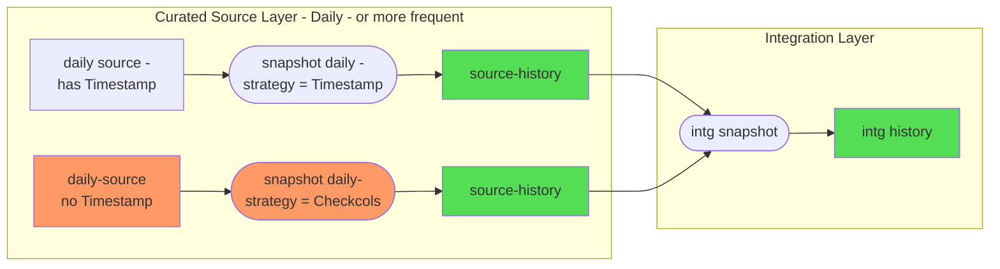
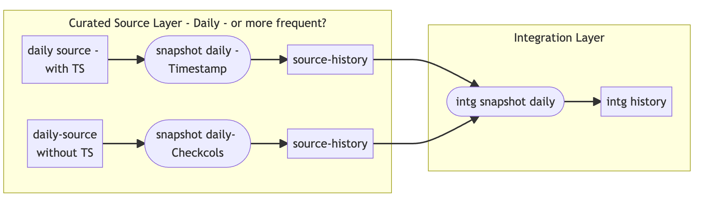
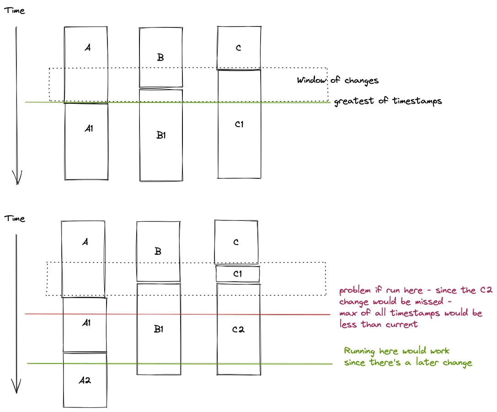

## Testing dbt snapshots

This project is an experiment in using multi-layer snapshots.


Note: install the mermaid plugin to see the above diagram within VS Code. otherwise, here's a recent grab of the render:


## General Approach

### Initial Proposal for Integration Layer


### Alternative Proposal for Integration Layer


### What's in this repo?
This repo contains [seeds](https://docs.getdbt.com/docs/building-a-dbt-project/seeds) that includes some (fake) raw data for this experiment. This is based off the examples
from the Confluence page here: 
[SVoC Integration Data Refresh Requirements and Options](https://confluence.iag.com.au/display/INAU/SVoC+Integration+Data+Refresh+Requirements+and+Options)

The raw data consists of:

* transaction_set
* transaction
* transaction_line

There are a number of variations of this entity data as it is processed:

* raw_cc_transaction_xxx tables - populated once via seed
* cc_transaction_xxx tables - populated by selecting a day's worth of data from the raw tables
* source_cc_transaction_xxx tables - result of snapshot processing of daily data
* intg_claim_transaction table - result of running an Integration snapshot


### Running this project
To get up and running with this project:
1. Install dbt using [these instructions](https://docs.getdbt.com/docs/installation).

2. Clone this repository.

3. Change into the `jaffle_shop` directory from the command line:
```bash
$ cd jaffle_shop
```

4. Set up a profile called `jaffle_shop` to connect to a data warehouse by following [these instructions](https://docs.getdbt.com/docs/configure-your-profile). 

So far, this has just been using a locally installed Postgress database on macOS. An easy way to get started with this is via the app [here](https://postgresapp.com/). 

To run SQL against the database, use any client such as:
* pgadmin 4 - https://www.pgadmin.org/
* https://eggerapps.at/postico/
* DBeaver - https://dbeaver.io/


Configure your local profiles.yml file to include a project like this:

```yaml
pg:
  target: dev
  outputs:
    dev:
      type: postgres
      host: localhost
      user: evan
      password: evan
      port: 5132
      dbname: evan
      schema: dev_evan
      threads: 1
      keepalives_idle: 0 # default 0, indicating the system default
```
5. Ensure your profile is setup correctly from the command line:
```bash
$ dbt debug
```

6. Load the CSVs with the demo data set. This materializes the CSVs as tables in your target schema. Note that a typical dbt project **does not require this step** since dbt assumes your raw data is already in your warehouse.
```bash
$ dbt seed
```
Each seed file contains data across a number of days - each day has a specific key, such as **d1**, **d2**, etc. 

7. Populate a day of data from the seed tables to the raw data, by running SQL like this:
```sql
-- only drop the tables if they already exist
--drop table cc_transaction_set;
--drop table cc_transaction;
--drop table cc_transaction_line;

select id,trandate,transet,userid,updatetime 
into cc_transaction_set
from raw_cc_transaction_set rt
where day_id = 'd1'
;
select id,transetid,"type",auth,updatetime  
into cc_transaction
from raw_cc_transaction rt
where day_id = 'd1'
;
select id,tranid,"desc",amount,updatetime 
into cc_transaction_line
from raw_cc_transaction_line rt
where day_id = 'd1'
;
```

8. Perform a daily snapshot:
```bash
$ dbt snapshot --select tag:source
```
This will produce / update the Daily snapshots to be used at the source layer

### Integration Layer

The integration layer combines data from a number of entities, but should also maintain history.

As discussed above, There are two ways of achieving this:

#### Integration Layer - Option 1

The initial proposal was to:

* use a specific point in time to "sample" the values for the consitituent rows - such as current timestamp, or batch timestamp
* join the rows together using the natural keys
* formulate a new updated timestamp for the combined rows - using the "greatest" of all the constituent timestamps

This was shown to work acceptably.

However, we have a concern around a possible edge case - this revolves around the lack of certainty of:
* when exactly extracts from the source system are performed
* the potential lack of synchronisation between tables

For example, consider 2 aspects in the following diagram:


The first diagram represents an inital snapshot of three tables: A, B and C - with slightly different last updated at timestamps

The second shows a potential issue when:

* an update to another table has occured
* and the updated timestamp for that table is earlier than the currently records "greatest" timestamp for the combined tables.

If the snapshot was taken at the red instant - the changes made as C1 would not be incorporated

If the snapshot was taken at the green instant - all would be ok, since the new "greatest" is older than the previous greatest timestamp.

For example, to see the effective data from 2021-07-03, this query joins the 3 entities:

An example snapshot process is in the model: `intg_claim_transaction`

```sql


{{
    config(
      tags=["intg"],
      unique_key='claim_transaction_key',
      target_schema='dev_evan',
      strategy='timestamp',
      updated_at='updatetime'
    )
}}

select concat(ts.id, '~', t.id, '~', tl.id) as claim_transaction_key
    , ts.trandate as trans_date
    , ts.transet  as trans_set_type
    , ts.userid   as trans_set_userid
    , t."type"    as trans_type
    , t.auth      as trans_authorised
    , tl."desc"   as trans_desc
    , tl."amount" as trans_amount
    , greatest(ts.dbt_updated_at, t.dbt_updated_at, tl.dbt_updated_at) as updatetime
    
from {{ ref('source_cc_transaction_set') }} ts 
  left join {{ ref('source_cc_transaction') }} t on ts.id = t.transetid
  left join {{ ref('source_cc_transaction_line') }} tl on t.id = tl.tranid
where '2021-07-03 23:59:59' between ts.dbt_valid_from and coalesce(ts.dbt_valid_to,'9999-12-31 23:59:59')
  and '2021-07-03 23:59:59' between t.dbt_valid_from  and coalesce(t.dbt_valid_to,'9999-12-31 23:59:59')
  and '2021-07-03 23:59:59' between tl.dbt_valid_from and coalesce(tl.dbt_valid_to,'9999-12-31 23:59:59')


```
This produces a result set like this:
```
claim_transaction_key|trans_date|trans_set_type|trans_set_userid|trans_type|trans_authorised|trans_desc|trans_amount|trans_update_time      |
---------------------+----------+--------------+----------------+----------+----------------+----------+------------+-----------------------+
123~372~3983         |2021-07-01|XT            |s26182          |Payment   |Yes             |New Laptop|         100|2021-07-01 12:01:16.000|
123~372~3984         |2021-07-01|XT            |s26182          |Payment   |Yes             |New iPhone|         150|2021-07-01 12:14:21.000|
123~389~4012         |2021-07-01|XT            |s26182          |Payment   |No              |New TV    |        1200|2021-07-01 12:45:11.000|
```
In practice, this could be driven by a processing date / or date spline to choose the correct date/timestamp:

#### Integration Layer - Option 2

To address the above scenario, an alternate means of creating an Integration snapshot could be used (with differences in **bold**):

* use a specific point in time to "sample" the values for the consitituent rows - such as current timestamp, or batch timestamp
* **use the checkcols strategy, but just across the consituent timestamp columns**
* join the rows together using the natural keys
* **use the batch timestamp as the "updated at" column for the combined rows**

This has a number of advantages:
* can easily be done multiple periods per day if required - independent of the frequency of the source layer
* the sample instance is (batch timestamp) is recorded as that - in the combined updated_at column

Possible cons:
* the combined updated timestamp is not a "business" timestamp value


For example, to see the effective data from an effective batch_timestamp, this query joins the 3 entities:

An example snapshot process is in the model: `intg_claim_transaction_checkminbatch`

```sql


{{
    config(
      tags=["intgcheckminbatch"],
      unique_key='claim_transaction_key',
      target_schema='dev_evan',
      strategy='check',
      check_cols=['ts_updatetime', 't_updatetime', 'tl_updatetime'],
      updated_at='updatetime'
    )
}}

-- use the timestamps to determine if there are any differences
-- but, use the batch timestamp as the timestamp

select concat(ts.id, '~', t.id, '~', tl.id) as claim_transaction_key
    , ts.trandate   as trans_date
    , ts.transet    as trans_set_type
    , ts.userid     as trans_set_userid
    , ts.updatetime as ts_updatetime

    , t."type"      as trans_type
    , t.auth        as trans_authorised
    , t.updatetime  as t_updatetime

    , tl."desc"     as trans_desc
    , tl."amount"   as trans_amount
    , tl.updatetime as tl_updatetime
    , to_timestamp('{{ var("batch_timestamp") }}', 'YYYY-MM-DD HH24:MI:SS')::timestamp as updatetime
    
from {{ ref('source_cc_transaction_set') }} ts 
  left join {{ ref('source_cc_transaction') }} t on ts.id = t.transetid
  left join {{ ref('source_cc_transaction_line') }} tl on t.id = tl.tranid
where to_timestamp('{{ var("batch_timestamp") }}', 'YYYY-MM-DD HH24:MI:SS')::timestamp between ts.dbt_valid_from and coalesce(ts.dbt_valid_to,'9999-12-31 23:59:59')
  and to_timestamp('{{ var("batch_timestamp") }}', 'YYYY-MM-DD HH24:MI:SS')::timestamp between t.dbt_valid_from  and coalesce(t.dbt_valid_to,'9999-12-31 23:59:59')
  and to_timestamp('{{ var("batch_timestamp") }}', 'YYYY-MM-DD HH24:MI:SS')::timestamp between tl.dbt_valid_from and coalesce(tl.dbt_valid_to,'9999-12-31 23:59:59')


```

This produces a result set like this:
```
claim_transaction_key|trans_date|trans_set_type|ts_updatetime          |ts_updatetime          |tl_updatetime          |trans_type|trans_authorised|updatetime             |dbt_valid_from         |dbt_valid_to           |
---------------------+----------+--------------+-----------------------+-----------------------+-----------------------+----------+----------------+-----------------------+-----------------------+-----------------------+
123~372~3983         |2021-07-01|XT            |2021-07-01 11:57:24.000|2021-07-01 11:57:24.000|2021-07-01 12:01:16.000|Payment   |Yes             |2021-07-01 23:59:59.000|2021-07-01 23:59:59.000|                       |
123~372~3984         |2021-07-01|XT            |2021-07-01 11:57:24.000|2021-07-01 11:57:24.000|2021-07-01 12:14:21.000|Payment   |Yes             |2021-07-01 23:59:59.000|2021-07-01 23:59:59.000|                       |
123~389~4012         |2021-07-01|XT            |2021-07-01 11:57:24.000|2021-07-01 11:57:24.000|2021-07-01 12:45:11.000|Payment   |No              |2021-07-01 23:59:59.000|2021-07-01 23:59:59.000|2021-07-02 23:59:59.000|
123~389~4012         |2021-07-01|XT            |2021-07-01 11:57:24.000|2021-07-01 11:57:24.000|2021-07-01 12:45:11.000|Payment   |Yes             |2021-07-02 23:59:59.000|2021-07-02 23:59:59.000|2021-07-03 23:59:59.000|
123~389~4012         |2021-07-01|XT            |2021-07-01 11:57:24.000|2021-07-01 11:57:24.000|2021-07-01 12:45:11.000|Payment   |Cancelled       |2021-07-03 23:59:59.000|2021-07-03 23:59:59.000|                       |
911~363~5628         |2021-07-02|GH            |2021-07-02 09:34:11.000|2021-07-02 09:34:11.000|2021-07-02 10:56:12.000|Payment   |No              |2021-07-02 23:59:59.000|2021-07-02 23:59:59.000|2021-07-03 23:59:59.000|
911~363~5628         |2021-07-02|GH            |2021-07-02 09:34:11.000|2021-07-02 09:34:11.000|2021-07-03 15:08:11.000|Payment   |Fraud           |2021-07-03 23:59:59.000|2021-07-03 23:59:59.000|                       |
```

### Further work

#### Snapshot Strategies

Investiagate the use of different snapshot strategies.

A current hypothesis is:
* the daily / source layer should use the Timestamp strategy
