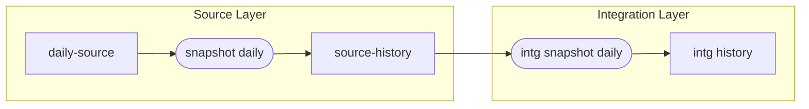

## Testing dbt snapshots`

This project is an experiment in using multi-layer snapshots.



### What's in this repo?
This repo contains [seeds](https://docs.getdbt.com/docs/building-a-dbt-project/seeds) that includes some (fake) raw data for this experiment. This is based off the examples
from the Confluence page here: 
[SVoC Integration Data Refresh Requirements and Options](https://confluence.iag.com.au/display/INAU/SVoC+Integration+Data+Refresh+Requirements+and+Options)

The raw data consists of:

* transaction_set
* transaction
* transaction_line

There are a number of variations of this entity data as it is processed:

* raw_cc_transaction_xxx tables - populated once via seed
* cc_transaction_xxx tables - populated by selecting a day's worth of data from the raw tables
* source_cc_transaction_xxx tables - result of snapshot processing of daily data
* intg_claim_transaction table - result of running an Integration snapshot


### Running this project
To get up and running with this project:
1. Install dbt using [these instructions](https://docs.getdbt.com/docs/installation).

2. Clone this repository.

3. Change into the `jaffle_shop` directory from the command line:
```bash
$ cd jaffle_shop
```

4. Set up a profile called `jaffle_shop` to connect to a data warehouse by following [these instructions](https://docs.getdbt.com/docs/configure-your-profile). 

So far, this has just been using a locally installed Postgress database on macOS. An easy way to get started with this is via the app [here](https://postgresapp.com/). 

To run SQL against the database, use any client such as:
* pgadmin 4 - https://www.pgadmin.org/
* https://eggerapps.at/postico/
* DBeaver - https://dbeaver.io/


Configure your local profiles.yml file to include a project like this:

```yaml
pg:
  target: dev
  outputs:
    dev:
      type: postgres
      host: localhost
      user: evan
      password: evan
      port: 5132
      dbname: evan
      schema: dev_evan
      threads: 1
      keepalives_idle: 0 # default 0, indicating the system default
```
5. Ensure your profile is setup correctly from the command line:
```bash
$ dbt debug
```

6. Load the CSVs with the demo data set. This materializes the CSVs as tables in your target schema. Note that a typical dbt project **does not require this step** since dbt assumes your raw data is already in your warehouse.
```bash
$ dbt seed
```
Each seed file contains data across a number of days - each day has a specific key, such as **d1**, **d2**, etc. 

7. Populate a day of data from the seed tables to the raw data, by running SQL like this:
```sql
-- only drop the tables if they already exist
--drop table cc_transaction_set;
--drop table cc_transaction;
--drop table cc_transaction_line;

select id,trandate,transet,userid,updatetime 
into cc_transaction_set
from raw_cc_transaction_set rt
where day_id = 'd1'
;
select id,transetid,"type",auth,updatetime  
into cc_transaction
from raw_cc_transaction rt
where day_id = 'd1'
;
select id,tranid,"desc",amount,updatetime 
into cc_transaction_line
from raw_cc_transaction_line rt
where day_id = 'd1'
;
```

8. Perform a daily snapshot:
```bash
$ dbt snapshot --select tag:source
```
This will produce / update the Daily snapshots to be used at the source layer

### Integration Layer

The integration layer combines data from a number of entities, but should also maintain history.

There are two ways of achieving this:

1. direct select statements peforming the appropriate joins
2. encoding this type of join statement into specific Integration snapshot processing - essentially materialising this information on a daily basis.

For example, to see the effective data from 2021-07-03, this query joins the 3 entities:
```sql
select concat(ts.id, '~', t.id, '~', tl.id) as claim_transaction_key
    , ts.trandate as trans_date
    , ts.transet  as trans_set_type
    , ts.userid   as trans_set_userid
    , t."type"    as trans_type
    , t.auth      as trans_authorised
    , tl."desc"   as trans_desc
    , tl."amount" as trans_amount
    , greatest(ts.dbt_updated_at, t.dbt_updated_at, tl.dbt_updated_at) as trans_update_time
    
from source_cc_transaction_set ts 
  left join source_cc_transaction t on ts.id = t.transetid
  left join source_cc_transaction_line tl on t.id = tl.tranid
where '2021-07-03 23:59:59' between ts.dbt_valid_from and coalesce(ts.dbt_valid_to,'9999-12-31 23:59:59')
  and '2021-07-03 23:59:59' between t.dbt_valid_from  and coalesce(t.dbt_valid_to,'9999-12-31 23:59:59')
  and '2021-07-03 23:59:59' between tl.dbt_valid_from and coalesce(tl.dbt_valid_to,'9999-12-31 23:59:59')
```
An example snapshot process is in the model: `intg_claim_transaction`

```sql


{{
    config(
      tags=["intg"],
      unique_key='claim_transaction_key',
      target_schema='dev_evan',
      strategy='timestamp',
      updated_at='updatetime'
    )
}}

select concat(ts.id, '~', t.id, '~', tl.id) as claim_transaction_key
    , ts.trandate as trans_date
    , ts.transet  as trans_set_type
    , ts.userid   as trans_set_userid
    , t."type"    as trans_type
    , t.auth      as trans_authorised
    , tl."desc"   as trans_desc
    , tl."amount" as trans_amount
    , greatest(ts.dbt_updated_at, t.dbt_updated_at, tl.dbt_updated_at) as updatetime
    
from {{ ref('source_cc_transaction_set') }} ts 
  left join {{ ref('source_cc_transaction') }} t on ts.id = t.transetid
  left join {{ ref('source_cc_transaction_line') }} tl on t.id = tl.tranid
where '2021-07-03 23:59:59' between ts.dbt_valid_from and coalesce(ts.dbt_valid_to,'9999-12-31 23:59:59')
  and '2021-07-03 23:59:59' between t.dbt_valid_from  and coalesce(t.dbt_valid_to,'9999-12-31 23:59:59')
  and '2021-07-03 23:59:59' between tl.dbt_valid_from and coalesce(tl.dbt_valid_to,'9999-12-31 23:59:59')


```
This produces a result set like this:
```
claim_transaction_key|trans_date|trans_set_type|trans_set_userid|trans_type|trans_authorised|trans_desc|trans_amount|trans_update_time      |
---------------------+----------+--------------+----------------+----------+----------------+----------+------------+-----------------------+
123~372~3983         |2021-07-01|XT            |s26182          |Payment   |Yes             |New Laptop|         100|2021-07-01 12:01:16.000|
123~372~3984         |2021-07-01|XT            |s26182          |Payment   |Yes             |New iPhone|         150|2021-07-01 12:14:21.000|
123~389~4012         |2021-07-01|XT            |s26182          |Payment   |No              |New TV    |        1200|2021-07-01 12:45:11.000|
```
In practice, this could be driven by a processing date / or date spline to choose the correct date/timestamp:

### Further work

#### Snapshot Strategies

Investiagate the use of different snapshot strategies.

A current hypothesis is:
* the daily / source layer should use the Timestamp strategy
